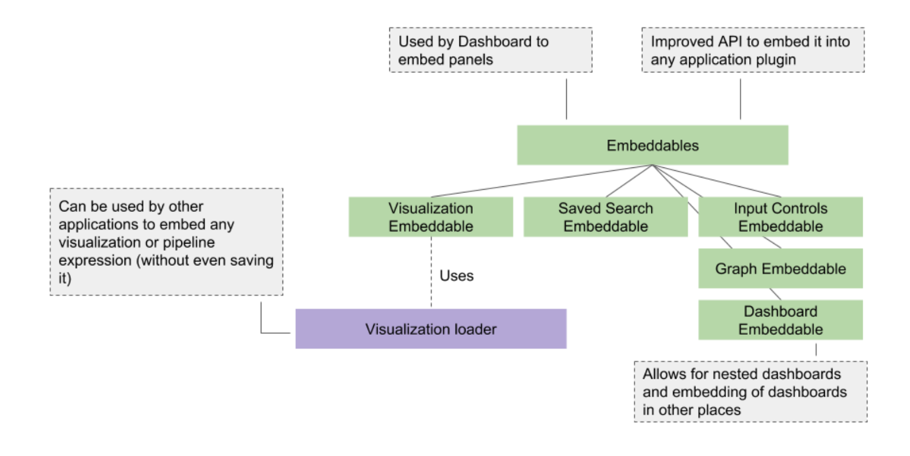

# Kibana Embeddable API & Embedding Visualizations

**NOTE:** The embeddable API and Visualizations have been in high flux for past 6 releases 7.4→7.9 versions in Kibana

## **In Version 7.5 and older**

1. [Elastic blog](https://www.elastic.co/blog/developing-new-kibana-visualizations) on embedding Visualization
2. [Test Plugin](https://github.com/elastic/kibana/tree/7.5/test/plugin_functional/plugins/kbn_tp_visualize_embedding) for Kibana Visualization embedding

**Between 7.6 and 7.8 - Embeddable API has changed at a high frequency, better to use it from 7.9**

## **Embeddable API - Situation post 7.9 update**

- Embeddables are re-usable widgets that can be rendered in any environment or plugin. Developers can embed them directly in their plugin. End users can dynamically add them to any embeddable _containers_.
- Containers are a special type of embeddable that can contain nested embeddables. Embeddables can be dynamically added to embeddable _containers_. _Currently only dashboard uses this interface._

* [Source](https://github.com/elastic/kibana/issues/19875)
* [Code](https://github.com/elastic/kibana/tree/master/src/plugins/embeddable)
* [README](https://github.com/elastic/kibana/blob/master/src/plugins/embeddable/README.md)

1. Visualizations, Saved Search and Dashboard embeddable are part of this API now.
2. Embeddable Factory allows to create objects:
   1. with “.create()” menthod → needs input of data/source/query/time range explicitly
   2. with “.createFromSavedObject()” method → either inherits values from containers or takes from explicit input provided
3. Each of the above has a implementation has to inherit an embeddable & Factory API like:
   1. [Viz. Embeddable](https://github.com/elastic/kibana/blob/master/src/plugins/visualizations/public/embeddable/visualize_embeddable.ts) & [Factory](https://github.com/elastic/kibana/blob/master/src/plugins/visualizations/public/embeddable/visualize_embeddable_factory.tsx)
   2. [Creating Custom Embeddable Example](https://github.com/elastic/kibana/blob/master/examples/embeddable_examples/public/multi_task_todo/multi_task_todo_embeddable.tsx) & [Factory](https://github.com/elastic/kibana/blob/master/examples/embeddable_examples/public/multi_task_todo/multi_task_todo_embeddable_factory.ts) by Value
   3. [Creating Custom Embeddable Example](https://github.com/elastic/kibana/blob/master/examples/embeddable_examples/public/todo/todo_ref_embeddable.tsx) & [Factory](https://github.com/elastic/kibana/blob/master/examples/embeddable_examples/public/todo/todo_ref_embeddable_factory.tsx) by reference
4. [Visualizations Embeddable API Code](https://github.com/streamich/kibana/tree/master/src/plugins/visualizations/public/embeddable)
5. [Dashboard Container](https://github.com/elastic/kibana/blob/master/src/plugins/dashboard/public/application/embeddable/dashboard_container.tsx) is exposed as an embeddable - to have multiple embeddable in a GRID like structure just like the Dashboard Plugin.

**Embeddable Examples**

- Examples folder in Kibana has all the usage samples for new APIs
- Use <EmbeddableRenderer/> to create new embeddable objects
- [Embeddable Examples](https://github.com/elastic/kibana/tree/master/examples/embeddable_examples) shows how to create new embeddable inheriting the API
- [Embeddable Explorer](https://github.com/elastic/kibana/tree/master/examples/embeddable_explorer)shows usage of these embeddable examples in a Panel Container
- [Dashboard Embeddable](https://github.com/elastic/kibana/tree/master/examples/dashboard_embeddable_examples) shows usage of these embeddable examples in a Dashboard Container

**Embeddable Renderer**

- The Kibana react Element/Prop to create new embeddable objects: [Code](https://github.com/elastic/kibana/blob/master/src/plugins/embeddable/public/lib/embeddables/embeddable_renderer.tsx)
- Embeddable container use the renderer to create/update each child(an embeddable object)
  - [Example Dashboard Container](https://github.com/elastic/kibana/blob/master/src/plugins/dashboard/public/application/embeddable/dashboard_container_by_value_renderer.tsx)
  - [Example of Static Embedding](https://github.com/elastic/kibana/blob/master/examples/embeddable_explorer/public/hello_world_embeddable_example.tsx#L59) (without factory)
  - [Example of Embedding with factory.create() method](https://github.com/elastic/kibana/blob/master/examples/embeddable_explorer/public/hello_world_embeddable_example.tsx#L73) (with factory)

## Embedding Visualizations in Notebooks Plugin

- Notebooks use embeddable API with dashboard containers for embedding visualizations
- Dashboard containers allow loading saved objects by Id
- Notebook paragraphs store the dashboard container object as json string in input cells
- For storing visualizations in Zeppelin input cells, the json string is stored with a prefix “%sh #{JSON_STRING}”. Making the Json object look like a comment so that, it doesn’t interrupt running the whole notebook.
